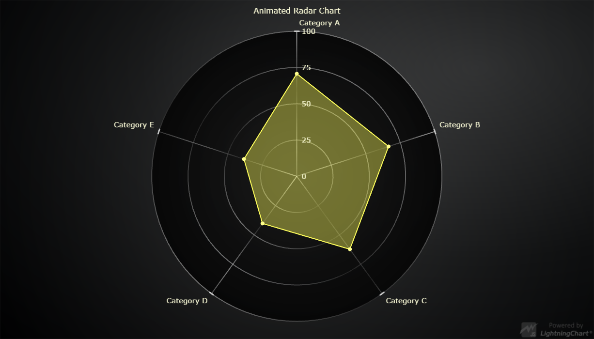

# Animated JavaScript Radar Chart



This demo application belongs to the set of examples for LightningChart JS, data visualization library for JavaScript.

LightningChart JS is entirely GPU accelerated and performance optimized charting library for presenting massive amounts of data. It offers an easy way of creating sophisticated and interactive charts and adding them to your website or web application.

The demo can be used as an example or a seed project. Local execution requires the following steps:

- Make sure that relevant version of [Node.js](https://nodejs.org/en/download/) is installed
- Open the project folder in a terminal:

        npm install              # fetches dependencies
        npm start                # builds an application and starts the development server

- The application is available at *http://localhost:8080* in your browser, webpack-dev-server provides hot reload functionality.


## Description

This example shows creation of a Radar Chart with animated transitions by using a suitably styled SpiderChart.

SpiderCharts can be styled to look like traditional Radar Charts by usage of SpiderWebModes - more specifically, SpiderWebMode.Circle.

```javascript
// Set web-mode of SpiderChart, affecting the shape of its background, webs and nibs.
spiderChart.setWebMode(SpiderWebMode.Circle)
```

Transitions can be set at regular intervals using setInterval like so:

```javascript
setInterval(() => {
    // This code will be called approximately every 100 milliseconds.
}, 100)
```


## API Links

* [Spider chart]
* [Spider web mode]
* [Spider series]


## Support

If you notice an error in the example code, please open an issue on [GitHub][0] repository of the entire example.

Official [API documentation][1] can be found on [Arction][2] website.

If the docs and other materials do not solve your problem as well as implementation help is needed, ask on [StackOverflow][3] (tagged lightningchart).

If you think you found a bug in the LightningChart JavaScript library, please contact support@arction.com.

Direct developer email support can be purchased through a [Support Plan][4] or by contacting sales@arction.com.

[0]: https://github.com/Arction/
[1]: https://www.arction.com/lightningchart-js-api-documentation/
[2]: https://www.arction.com
[3]: https://stackoverflow.com/questions/tagged/lightningchart
[4]: https://www.arction.com/support-services/

© Arction Ltd 2009-2020. All rights reserved.


[Spider chart]: https://www.arction.com/lightningchart-js-api-documentation/v3.4.0/classes/spiderchart.html
[Spider web mode]: https://www.arction.com/lightningchart-js-api-documentation/v3.4.0/enums/spiderwebmode.html
[Spider series]: https://www.arction.com/lightningchart-js-api-documentation/v3.4.0/classes/spiderseries.html

